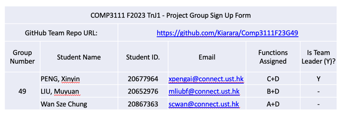

# Comp3111F23G49

Group Formation Form: 

**Project Description:**  
This is simple Java project which contains 3 main functions:
* Function A: creates a maze using MST algorithm (the maze generated is called "actual_maze.csv")
* Function B: calculates the shortest path using BFS between two locations on a maze
* Function C: a game where the player controls Jerry to reach exit from entry of a maze without being caught by Tom
  * Before the game starts, players can choose the difficulty level(easy/medium/hard) of the game
  * Player controls Jerry by indicating its moving direction using keyboard 
  * Tom is controlled by the computer - it sets out from the exit point and always moves towards Jerry according to the realtime shortest path to Jerry
  * During the game, if Jerry comes across freezer, Tom will be frozen for a specific period of time
  * During the game, if Jerry comes across its friend Tuffy, the current shortest path between Jerry and the exit point will be displayed for a specific period of time
  * After each round of game, the player can choose to restart or exit

**How to run the project:** 
Our team has created a main menu for trying different functions in one go, to initiate the main menu, you can
* run the jar file named "COMP3111F23G49.jar" located in the ~/COMP3111F23G49/out/artifacts/COMP3111F23G49_jar
* run the main function of the class "GameControlFrame" in the package named "Shared"

To try each function separately, you can build and run the following functions:  
* Function A: main function of the class "Main_A" in the package named "Function_A"
* Function B: main function of the class "Main_B" in the package named "Function_B"
* Function C: main function of the class "Main_C" in the package named "Function_C"

**How to test the project:** 
Simply run the unit tseting files in the folder named "test" 
Note that:  
* There could be windows popping out during testing. In those situations, you could just ignore and wait for the test cases to finish, after which those windows will be closes
* There could be some warnings caused by Java/library version, which should not affect the results of the testing
* There could be some exception thrown by outdated instruction given by timed event or button click, which should not affect the results of the testing, and won't appear if those test cases are test separately